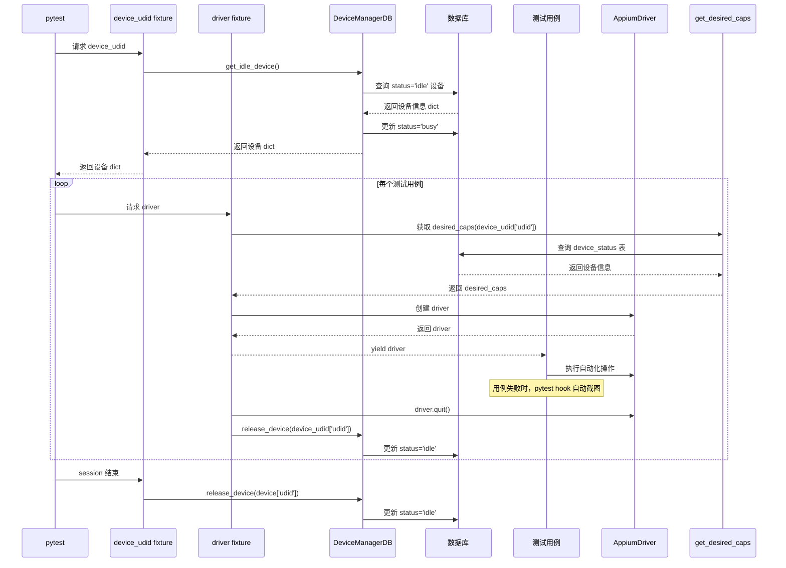

# 自动化测试用例执行链路说明

## 1. 流程概述

本项目基于 pytest + Appium，结合数据库设备状态管理，实现了自动化测试用例的设备分配功能

---

## 2. 主要流程步骤

### 2.1 pytest 启动测试
- pytest 自动发现 tests 目录下的测试用例。
- pytest 自动加载 conftest.py 文件中的 fixture。

### 2.2 会话级 fixture：`device_udid`
- pytest 首次需要 device_udid fixture 时，执行：
  1. 实例化 `DeviceManagerDB`。
  2. 调用 `device_manager.get_idle_device()`，从数据库查找空闲设备（status='idle'），并将其状态置为 'busy'，返回设备信息 dict。
  3. 如果没有可用设备，则 pytest.fail 终止测试。
  4. 用例执行完毕后（session 结束），调用 `device_manager.release_device(device['udid'])`，将设备状态重置为 'idle'。

### 2.3 函数级 fixture：`driver`
- 每个测试用例函数执行前，pytest 调用 driver fixture：
  1. 记录日志，准备创建 driver。
  2. 调用 `get_desired_caps(device_udid['udid'])`，获取当前设备的 desired_caps。
     - get_desired_caps 内部会调用 `create_desired_caps`，从数据库 device_status 表查出 platformName、platformVersion、deviceName 等信息，组装 desired_caps。
  3. 用 desired_caps 创建 Appium driver 实例（`webdriver.Remote`）。
  4. 设置 driver 隐式等待。
  5. yield driver 给测试用例。
  6. 测试用例执行完成后，finally 块执行：
     - 如果 driver 存在，调用 driver.quit() 关闭会话。
     - 无论是否异常，调用 `device_manager.release_device(device_udid['udid'])`，将设备状态重置为 'idle'。

### 2.4 测试用例执行
- 测试用例函数获得 driver 实例，执行自动化操作。
- 若用例失败，pytest_runtest_makereport hook 会自动截图并添加到 Allure 报告。

### 2.5 设备释放与状态恢复
- 每个用例执行完毕，driver fixture 的 finally 块确保设备状态被释放。
- session 结束时，device_udid fixture 也会再次释放设备（冗余保护）。

### 2.6 设备状态全流程
- 设备分配：get_idle_device → 数据库 status 置为 'busy'
- 用例执行：driver fixture 创建 driver
- 用例结束/异常：driver fixture finally → release_device → 数据库 status 置为 'idle'
- session 结束：device_udid fixture → release_device（冗余释放）

---

## 3. 详细时序图

---

## 4. 关键调用链路总结

1. pytest 启动 → 加载 conftest.py
2. device_udid fixture 分配设备（DB查找并置busy）
3. driver fixture 获取 desired_caps（DB查找设备信息）→ 创建 Appium driver
4. 测试用例执行
5. driver fixture finally 释放设备（DB置idle）
6. session 结束，device_udid fixture 再次释放设备
